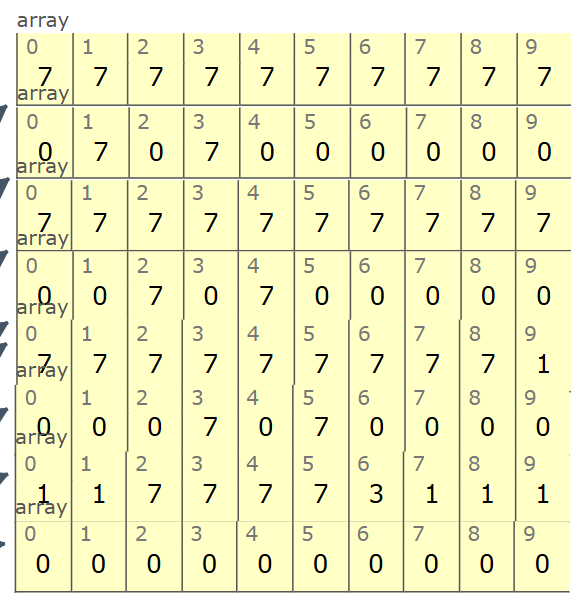

Labirinto de Tubos: Um Estudo Prático de BFS
===
O Projeto
---
Este repositório contém um estudo prático do algoritmo de busca em largura (**Breadth-First Search - BFS**). O objetivo foi aplicar o algoritmo para encontrar a solução ótima (o caminho com o mínimo de passos) para um problema de labirinto gerado dinamicamente.

O desafio consiste em um jogo onde o jogador deve navegar por uma série de "tubos" verticais conectados por passagens. A quantidade de tubos, as localizações das conexões e a posição final da porta são definidas pelo usuário, criando um novo mapa a cada execução.

A Solução
---
A escolha pelo BFS foi natural, pois sua característica de explorar o mapa em "camadas" garante que o primeiro caminho encontrado até o objetivo seja, por definição, o mais curto.

A lógica implementada constrói o mapa e, em seguida, utiliza uma **fila** para visitar sistematicamente todas as casas alcançáveis, camada por camada, até encontrar a porta.

Exemplo de funcionamento
---
|Resultado|Entrada|Saída|
|:-------------------:|:---:|:---:|
||4 (Quantidade de tubos); 1, 3, 2, 4, 3, 5 (Conexões entre os tubos); 6 (Posição da porta)| 15 (Quantidade mínima de passos) |

Explore o Código
---
O código está comentado para guiar através da implementação. Convido você a explorar como o mapa é construído, como a fila do BFS é gerenciada e, principalmente, como a contagem de "passos" foi estruturada para refletir as camadas de busca do algoritmo.

[Link da Plataforma para rodar o código](https://megatron0000.github.io/another-pythontutor-frontend/#edit)

    /*Definicoes de abreviacoes: qntd=Quantidade; pos=Posicao; def=Define; bfs=Breadth-First Search; taman=Tamanho*/
    /*Definicoes de jogo: 1=Caminho (pode andar por); 0=Nao-caminho (nao pode andar por); 7=jogador; 3=porta*/
    
    var mapa = [];
    var i, qntd_tubo, pos_porta, fim_jogo;
    
    function def_mapa(tubo){
        for (i=0; (i<tubo*2); i++){
            if (i%2===0){
                mapa[i] = [1,1,1,1,1,1,1,1,1,1];
            } else{
                mapa[i] = [0,0,0,0,0,0,0,0,0,0];
            }
        }
    }
    function def_conexao(coluna, posicao1, posicao2){
        mapa[coluna][posicao1] = 1;
        mapa[coluna][posicao2] = 1;
    }
    function def_jogador_porta(posicao){
        mapa[0][9] = 7;
        mapa[(qntd_tubo*2)-2][posicao] = 3;
    }
    function passo_bfs(){
        var p = 0;
        var fila = [
                    [0, 9]
                    ];
        var taman_fila;
        while (fim_jogo===false){
            taman_fila = fila.length;
            for (i=0;i<taman_fila;i++){
                if (mapa[fila[0][0]][(fila[0][1])-1]===1){
                    mapa[fila[0][0]][(fila[0][1])-1] = 7;
                    fila.push([fila[0][0], (fila[0][1])-1]);
                } else if(mapa[fila[0][0]][(fila[0][1])-1]===3){
                    fim_jogo = true;
                }
                if (mapa[fila[0][0]][(fila[0][1])+1]===1){
                    mapa[fila[0][0]][(fila[0][1])+1] = 7;
                    fila.push([fila[0][0], (fila[0][1])+1]);
                } else if(mapa[fila[0][0]][(fila[0][1])+1]===3){
                    fim_jogo = true;
                }
                if (mapa[(fila[0][0])+1][fila[0][1]]===1){
                    mapa[(fila[0][0])+1][fila[0][1]] = 7;
                    fila.push([(fila[0][0])+1, fila[0][1]]);
                }
                fila.shift();
            }
            p++;
        }
        return p;
    }
    
    fim_jogo = false;
    qntd_tubo = input();
    def_mapa(qntd_tubo);
    for (i=1; i<=(mapa.length)-2; i+=2){
        def_conexao(i, input(), input());
    }
    pos_porta = input();
    def_jogador_porta(pos_porta);
    output('Quantidade minima de passos para ganhar:')
    output(passo_bfs());
